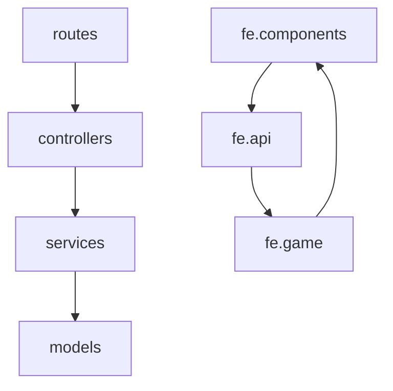

# repo-map

## Purpose

Produce the factual description of a codebase that every other skill reads instead of
rediscovering: what the stack is, what each folder is for, what features exist and where they
live, what depends on what, and how the repo divides into reviewable modules.

**This skill does not review.** It records facts. A cycle in the dependency graph is a fact and
belongs here; "this cycle is bad" is a judgment and belongs to `architecture-review`. Keeping
that line sharp is what makes the map reusable — a map with opinions baked in becomes stale the
moment someone disagrees with the opinion.

It is also the cheapest artifact in the suite: built almost entirely from aggregated `git` and
`rg` output, never from reading files in bulk.

## Activation examples

- "Map this repo" / "what's in this project?"
- "Build the project map before we audit"
- "What are the dependencies between our modules?"
- "List the features and where they live"
- "How is this codebase organized?"
- Invoked by `project-auditor` at step 1, and by `knowledge-sync` when no map exists.

## Required reading

`_shared/context-budget.md` (module sizing rules — the partition must obey them).
`_shared/review-protocol.md` §7 (budget) applies. The issue/report formats do **not** apply:
this skill emits no findings.

## Inputs

Optional: `scope` (a subdirectory to map instead of the whole repo), `refresh` (rebuild an
existing map), `depth` (`quick` = stack + folders + modules only; `full` = all five artifacts,
default).

## Workflow

### 1. Skeleton (aggregate only — never dump the file list)

```bash
git rev-parse --short HEAD
git ls-files | wc -l
git ls-files | sed 's|/[^/]*$||' | sort | uniq -c | sort -rn | head -60
git ls-files | sed 's/.*\.//' | sort | uniq -c | sort -rn | head -20      # language mix
git log --format= --name-only --since=6.months | grep -v '^$' | sort | uniq -c | sort -rn | head -30
git log -1 --format=%cd; git log --oneline | wc -l                        # age and activity
```

Exclusions at this stage, not later: `node_modules`, `dist`, `build`, `coverage`, `vendor`,
`.min.*`, lockfiles, binary assets.

### 2. Tech Stack

Read only: root and per-workspace `package.json`, `README.md`, `CLAUDE.md`/`AGENTS.md`,
`CONTRIBUTING.md`, build/test/lint configs, `Dockerfile`, `docker-compose.yml`, CI workflows,
`.env.example` (names only — never values).

For each dependency that shapes the architecture, record **what it is used for**, verified:

```bash
rg -l "from 'chart.js'|require\('chart.js'\)" --glob '!node_modules' . | head
```

A dependency in `package.json` with zero import sites is a fact worth recording (`declared, no
import sites found`) — leave the conclusion to `technical-debt-review`.

**Framework detection** — this drives lens gating downstream, so it must be evidence-based, not
inferred from folder names. Follow the signature table in
`project-auditor/references/stack-detection.md`: a framework counts as present only with **both** a
dependency signal and a code signal. Record the **major version** (rules differ across React 17/18/19,
Express 4/5, Vue 2/3, Next pages/app router), the code-signal counts, and **which modules the code
signal actually appears in** — a React repo can still contain a vanilla-JS panel that no React lens
should ever touch.

Emit this block verbatim in the map; `project-auditor` reads it at step 3b and refuses to dispatch a
framework lens that is not listed as detected:

```markdown
## Detected Frameworks

| Framework | Version | Dependency signal | Code signal | Modules | Verdict |
|---|---|---|---|---|---|
| React | 19.2 | `frontend/package.json` | 85 `.jsx` files | fe.* except admin | detected |
| Express | 4.16 | `backend/package.json` | `backend/server.js:44`, 28 routers | be.* | detected |
| Vue | — | absent | absent | — | not present |

**Not framework code:** `backend/public/admin/**` — vanilla JS, no framework signal.
```

### 3. Folder Purpose

One line per significant directory: what it holds, who owns it, whether it is app code, ops,
generated, or vendored. Derive the purpose from the files' names and their exports, not from
reading bodies — open at most one representative file per directory when the name is ambiguous.

Also record the **declared conventions** verbatim-ish from `CLAUDE.md`/`CONTRIBUTING.md`. These
travel with the map into every audit prompt, and they are what findings get measured against.

### 4. Feature List

Work from user-visible capability down to code, so the list is meaningful to a human:

- entry points: routers, top-level screens/routes, nav definitions, admin tabs, CLI scripts
- for each feature: name, surface (route/screen/endpoint prefix), primary files, and the data it
  owns (models/collections/tables)

```bash
rg -o "router\.(get|post|put|patch|delete)\(['\"][^'\"]+" backend/routes --no-filename | sort -u
rg -o "app\.use\(['\"][^'\"]+" backend/server.js -r '$1'
rg -o "case ['\"]\w+['\"]" <nav-or-router-file> --no-filename | sort -u
```

Mark each feature `active`, `partially migrated`, or `unreferenced` — with the evidence
(no route mounted, no nav entry, no importer). Again: fact, not verdict.

### 5. Dependency Graph

Extract edges mechanically, then aggregate to **module level** (file-level graphs are too large
to be useful in a map):

```bash
# raw edges
rg -o --no-filename "(?:require\(|from\s+)['\"]([^'\"]+)['\"]" -r '$1' <scope> \
  | rg -v '^[a-z@]' | sort | uniq -c | sort -rn | head -60      # internal (relative/alias) only
# who imports a given directory
rg -l "components/shop|@components/shop" --glob '!node_modules' . | sed 's|/[^/]*$||' | sort -u
```

Record, per module: **fan-out** (modules it imports), **fan-in** (modules importing it), and
**cycles** with their full edge list. Then note two structural facts that are hard to see later:

- **Layer edges** — classify each edge as inward, outward, or sideways relative to the declared
  layering. Report the counts; do not editorialize.
- **Implicit coupling** — dependencies with no import statement: `<script>` load order in
  server-rendered pages, event-bus topics, global window objects, DB collection sharing, string-
  keyed dynamic requires. These are invisible to grep-based graphs and are exactly what a
  reviewer needs told. List the mechanism and the files.

Render the graph as a Mermaid block plus an adjacency table. Keep it to module granularity; if
the graph exceeds ~40 nodes, group by layer and provide one sub-graph per layer.

### 6. Module partition (`modules.md`)

Apply the sizing rules in `_shared/context-budget.md`: 5–25 files or ≤4,000 LOC, one purpose,
one technology, cut along a real boundary. Assign each module a `Kind` from the dispatch matrix
in `project-auditor/references/orchestration.md`, and the lens set that matrix implies.

Verify the partition before writing: every tracked non-excluded file belongs to exactly one
module or to a `not-reviewed` bucket with a reason. State the check result.

### 7. Write the artifacts and report

`.claude-audit/PROJECT-MAP.md` and `.claude-audit/modules.md`. Return a summary of ≤25 lines:
counts, the stack in one line, module count, cycle count, implicit-coupling count, and anything
you could not determine. Do not return the map itself — it is on disk for whoever needs it.

## Review checklist

This skill reviews nothing; the checklist is for the map's own quality.

**Coverage** — [ ] every tracked file is in a module or an explained exclusion · [ ] every
workspace's `package.json` read · [ ] every entry point found (routers, screens, admin tabs,
scripts, workers) · [ ] scope stated if partial

**Accuracy** — [ ] every stack claim traceable to a config file or an import site · [ ] every
dependency edge from an actual import, not an assumption · [ ] every cycle listed with its full
edge path · [ ] feature status backed by evidence (mounted route, nav entry, importer)

**Framework detection** — [ ] `Detected Frameworks` block present · [ ] every `detected` has both a
dependency and a code signal · [ ] major version recorded · [ ] modules where the code signal
appears listed · [ ] non-framework areas called out explicitly · [ ] declared-but-unused
dependencies marked `not present`, not `detected`

**Neutrality** — [ ] no severity, no verdict, no "should" · [ ] facts that look like problems
(cycles, unreferenced features, unused dependencies) recorded as observations with evidence and
routed to the lens that judges them

**Usability** — [ ] a newcomer can find where a feature lives from the map alone ·
[ ] declared conventions captured for audit prompts · [ ] modules obey the sizing rules ·
[ ] the map states its commit sha so staleness is detectable

**Budget** — [ ] built from aggregated command output, not bulk reading · [ ] ≤ ~30 files
actually read · [ ] no file contents pasted into the map

## Best practices

- **Aggregate before you look.** `uniq -c | sort -rn` turns 10,000 paths into 40 lines. Every
  discovery step in this skill is designed to be summarized by the shell, not by you.
- **Record the sha.** `PROJECT-MAP.md` without the commit it describes cannot be checked for
  staleness, which destroys its value for `knowledge-sync`.
- **Implicit coupling is the map's highest-value section.** Import graphs are easy; load-order
  and event-bus coupling is what a reviewer cannot reconstruct alone.
- **Name features in the product's language** (and the project's language), not in class names.
  The map is read by humans deciding what to audit.
- **Say what you could not determine.** "Ownership of `backend/data/*` unclear — no importer,
  referenced by 2 scripts" is useful. Guessing is not.
- **Regenerate rather than patch** when the repo has moved significantly; a half-updated map is
  worse than an obviously old one.

## Anti-patterns

- ❌ Reviewing. No findings, no severities, no recommendations.
- ❌ Reading files in bulk "to understand the project" — the map is built from structure
- ❌ A file-level dependency graph with 500 nodes
- ❌ Copying `package.json` verbatim instead of stating each dependency's role
- ❌ Listing folders without saying what they are for
- ❌ Inventing an architecture the code does not show (labelling something "clean architecture"
  because there is a `services/` folder)
- ❌ Putting real values from `.env` files anywhere in the map

## Output template

`.claude-audit/PROJECT-MAP.md`:

```markdown
# Project Map — <repo>

- **Commit:** `<sha>` · **Generated:** <YYYY-MM-DD> · **Scope:** whole repo | <path>
- **Size:** <N> tracked files · <L> LOC (app code) · <C> commits · last commit <date>
- **Read to build this map:** <N> files

## Tech Stack

| Concern | Choice | Version | Used for | Evidence |
|---|---|---|---|---|
| Backend | Express | ~4.16 | HTTP API | `backend/server.js:1` |
| Data | MongoDB + Mongoose | 9.x | 41 models | `backend/models/*` |
| Client state | React Context | 19.x | single GameContext | `frontend/src/game/GameContext.jsx` |

**Declared conventions** (the yardstick for any later audit)
- <verbatim-ish rule> — source: `<file>`

**Declared, no import sites found:** <dependency list, if any>

## Folder Purpose

| Path | Holds | Kind | Notes |
|---|---|---|---|
| `backend/routes` | 28 Express routers, one per domain | app | mounted in `server.js:44-72` |
| `backend/public/admin` | vanilla-JS admin dashboard | app | 20 `<script>` tags, load-order coupled |
| `backend/data` | seed JSON | data | no importer; used by 2 scripts |

## Feature List

| Feature | Surface | Primary files | Owns data | Status |
|---|---|---|---|---|
| TOEIC full test | `/api/toeic/*`, `components/toeic/runner` | 17 files | `ToeicTest`, `ToeicAttempt`, `ToeicQuestionSet` | active |
| Shop & inventory | `/api/shop`, `/api/inventory` | 6 files | `ItemDefinition`, `InventoryItem` | active |
| Legacy shop items | — | `models/ShopItem.js` | `ShopItem` | unreferenced (merged into catalog) |

## Dependency Graph



| Module | Fan-out | Fan-in | Notes |
|---|---|---|---|
| `fe.game` | 4 | 21 | highest fan-in in the frontend |

**Cycles**
1. `fe.game/state.js:12 → fe.components/Home.jsx:4 → fe.game/GameContext.jsx:9 → fe.game/state.js`

**Layer edges:** inward <n> · outward <n> · sideways <n>

**Implicit coupling** (no import statement)
- `backend/public/admin`: 20 `<script>` tags in `dashboard.html:119-142` — load order is the
  dependency graph; `core/state.js` must precede all features.
- `EventBus` topics: <topic → emitters/listeners>
- Shared collections written by both `<a>` and `<b>`

## Module Partition

See `.claude-audit/modules.md`. <N> modules · <M> not-reviewed buckets.
Partition check: every tracked file assigned — yes/no (+ what is unassigned).

## Unknowns

- <what could not be determined, and what would settle it>
```

`.claude-audit/modules.md` uses the table from `project-auditor/SKILL.md` step 3:
`# | slug | path(s) | kind | files | ~LOC | lenses | order | why this order`.

## Directory structure

```
.claude/skills/repo-map/
└── SKILL.md

outputs → .claude-audit/PROJECT-MAP.md
          .claude-audit/modules.md
```